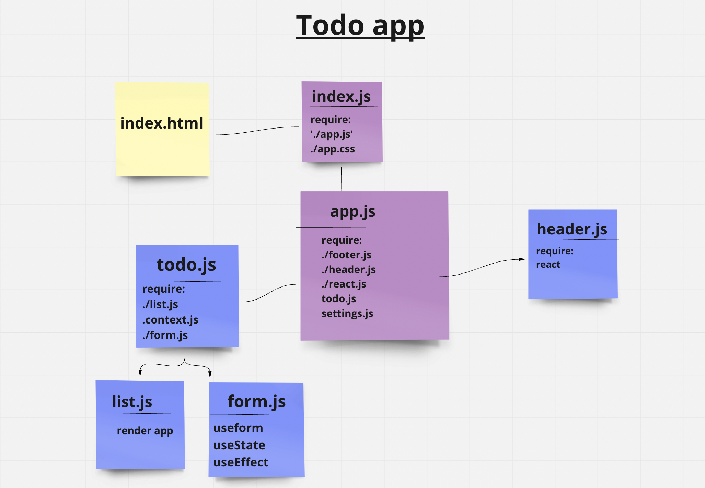

# todo-app

we’ll be adding some top-level settings for the application, so that the user can make some display choices that the app will use by default.

## Context as global state

Context provides a way to pass data through the component tree without having to pass props down manually at every level

## What is React Hook Form?

React Hook Form takes a slightly different approach than other form libraries in the React ecosystem by adopting the use of uncontrolled inputs using ref instead of depending on the state to control the inputs. This approach makes the forms more performant and reduces the number of re-renders.

- The technologies used to create todo app:
  - blueprint
  - React JS:

1. useContext
2. useState
3. useEffect
4. useForm

## UML

## [Netlify](https://saraaltayeh.github.io/todo-app/)
